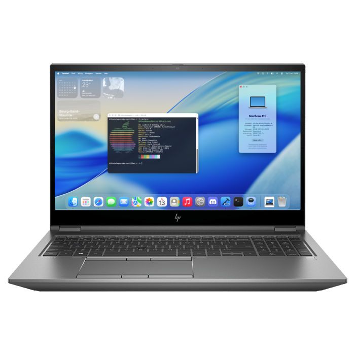

  

# 🍎 HP ZBook Fury G7 Hackintosh – Quad Boot with macOS 26 Tahoe

> ⚠️ **First Boot Warning**
> If you see a **black screen after the Apple loading bar**, simply **close and reopen the lid**.
> Then apply the **4K + EDID patch** using [One-Key HiDPI](https://github.com/xzhih/one-key-hidpi) to fix GUI scaling and boot screen visibility permanently.

---

## 📌 Repo Description

Fully working Hackintosh EFI for **HP ZBook Fury 15 G7** (Intel i9, 64GB RAM, 4K touchscreen), quad-booting:

* ✅ macOS 26 Tahoe Beta
* ✅ Windows 11 Pro
* ✅ Ubuntu
* ✅ Kali Linux

With full support for:

* 4K HiDPI internal display
* Touchscreen
* Audio, Wi-Fi, Bluetooth
* Sleep/wake
* iServices (iMessage, FaceTime, iCloud)

---

## 💾 Storage Layout

| OS         | Drive                   | Format      |
| ---------- | ----------------------- | ----------- |
| macOS      | Samsung 980 Pro 512GB   | APFS (GUID) |
| Windows 11 | Intel 620P 512GB        | NTFS (GPT)  |
| Ubuntu     | NVMe 256GB (same model) | ext4 + GRUB |
| Kali Linux | 256GB Kingston NVMe     | ext4 + GRUB |

---

## 🧰 EFI Highlights

* Based on OpenCore latest stable release
* Patched for macOS 26 Tahoe Beta 3
* SMBIOS: `MacBookPro16,2`
* Platform ID: `07009B3E`
* dGPU (`Quadro T2000`) disabled with `-wegnoegpu`
* Working **internal screen** with full acceleration
* USB ports mapped via `USBMap.kext`
* Wi-Fi configured for Recovery via `itlwm.kext` + preloaded credentials

---

## 📋 Required Kexts

* `Lilu.kext`
* `WhateverGreen.kext`
* `AppleALC.kext`
* `VirtualSMC.kext`
* `itlwm.kext` *(AirportItlwm does work in Recovery up to macOS Sonoma. Starting from Sequoia, it requires post-install patches via OCLP — which are not yet available for Tahoe, so use `itlwm.kext` instead)*
* `IntelBluetoothFirmware.kext`
* `VoodooI2C + VoodooI2CHID.kext`
* `VoodooPS2Controller.kext`
* `CPUFriend + CPUFriendDataProvider.kext`
* `SMCBatteryManager.kext`, `SMCProcessor.kext`, `SMCSuperIO.kext`
* `NVMeFix.kext`
* `RTCMemoryFixup.kext`

---

## 📘 Documentation

👉 Full install guide: [`Docs/INSTALL.md`](Docs/INSTALL.md)

Covers:

* USB formatting (FAT32 + GPT)
* Sequoia macrecovery method via `macrecovery.py`
* Tahoe upgrade steps
* Critical Wi-Fi config for Recovery
* BIOS settings
* OpenLinuxBoot setup for dual-boot

---

## 📸 Preview

---

## 🧠 Credits

* [Dortania Guide](https://dortania.github.io)
* [xzhih – One-Key HiDPI](https://github.com/xzhih/one-key-hidpi)
* [acidanthera](https://github.com/acidanthera)
* [CorpNewt](https://github.com/corpnewt)
* Built with ❤️ by **Kilian**
* Sleep fix credits to [helemen7](https://github.com/helemen7) for discovering `igfxonln=1` magic 💤
* Bluetooth fix also by helemen7 because Kilian forgot the NVRAM variable 😅 (it's OK, he's cat-obsessed too 🐾😹)
